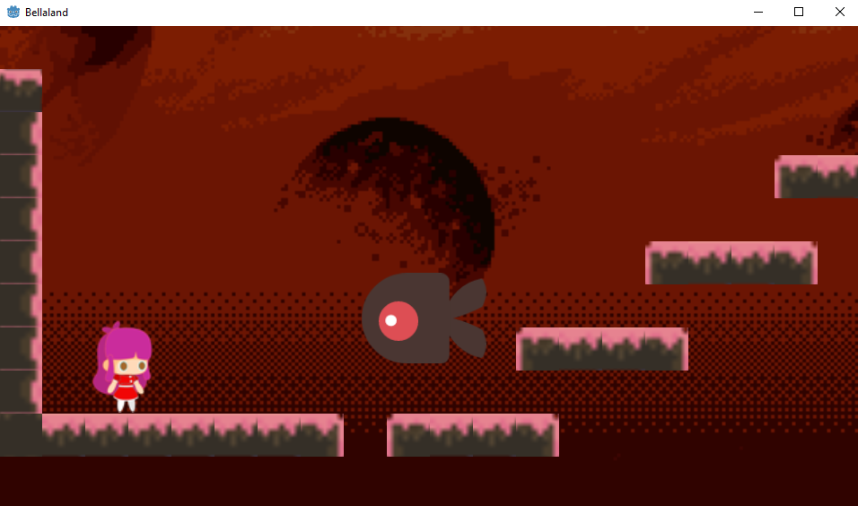

# Bellaland
Acompaña a Bella a liberar su mundo rosa de las tinieblas

# Portada

# Organizacion
src: Codigo y Escenas.  
res: Recursos estáticos, fuente, tilesets y sprites.

# Creditos de Arte
Bella: https://www.gameart2d.com/cute-girl-free-sprites.html
 
Tileset: https://opengameart.org/content/8x8-platformer-tileset-candy-land

# Creditos sonidos
Hit: https://opengameart.org/content/attack-miss-or-hit-sounds2
 
Musica de fondo: https://opengameart.org/content/game-music-loop-rising
 
Salto: https://freesound.org/people/cabled_mess/sounds/350905/
 
Muerte: https://opengameart.org/content/8bit-death-whirl
 
Game over: https://opengameart.org/content/game-over-0
 
UI aceptar: https://opengameart.org/content/ui-accept-or-forward

# Licencia
Restringido el uso de recursos de terceros a sus respectivas licencias.  
Cualquier recurso no-externo queda disponible para cualquier uso.
